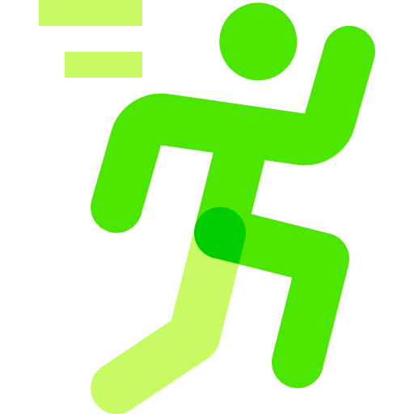
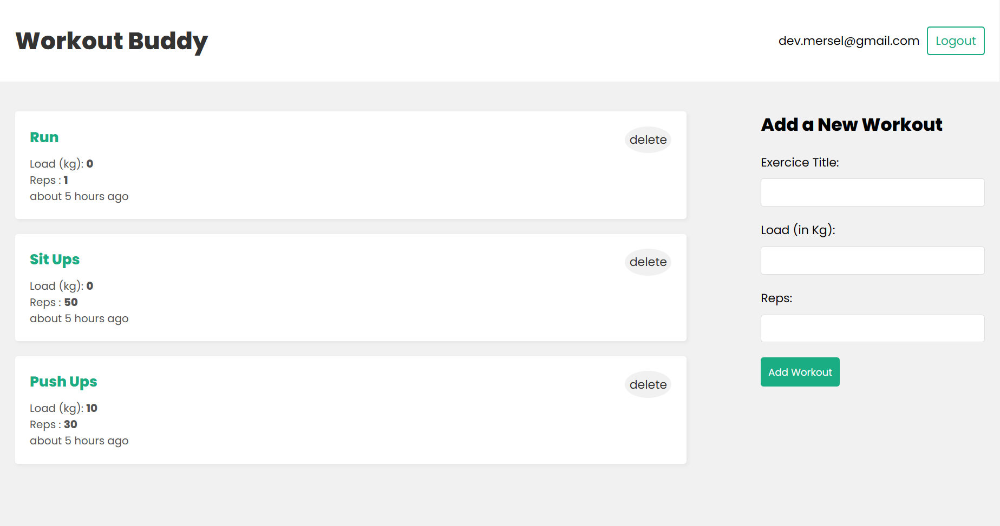

<br />
<div align="center">
  <a href="https://github.com/lyes-mersel/tuto-workouts-frontend">
    
  </a>

  <h3 align="center">WORKOUT</h3>

  <p align="center">
    <a href="https://tuto-workout.vercel.app">View Demo</a>
    .
    <a href="https://github.com/lyes-mersel/tuto-workouts-backend">API Repo</a>
  </p>
  <br />
</div>


## About The Project
This is a small web app I build to practice MERN Stack. My main purse was to implement a secure authentification.




## Built With

-  HTML/CSS
-  JavaScript
-  React JS


## Installation

1. Clone the repo
   ```sh
   git clone https://github.com/lyes-mersel/tuto-workouts-frontend.git
   ```
2. Install NPM packages
   ```sh
   npm install
   ```
3. Launch the server
    ```sh
    npm start
    ```


## Author
- Website - [Portfolio](https://lyes-mersel.netlify.app)
- Github - [@lyes-mersel](https://github.com/lyes-mersel)
- LinkedIn - [@lyes-mersel](https://www.linkedin.com/in/lyes-mersel/)
